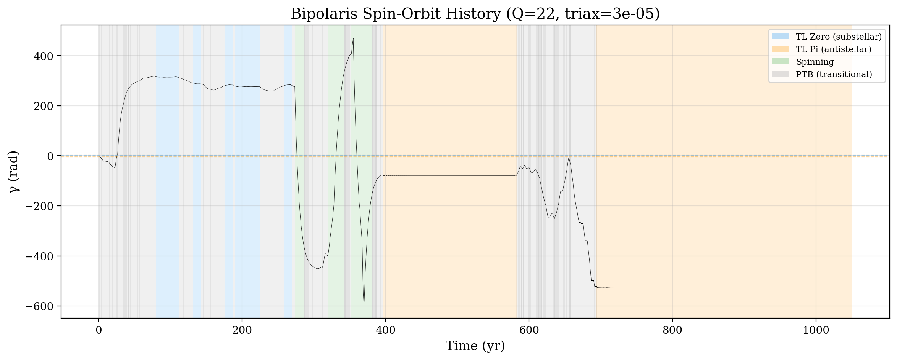
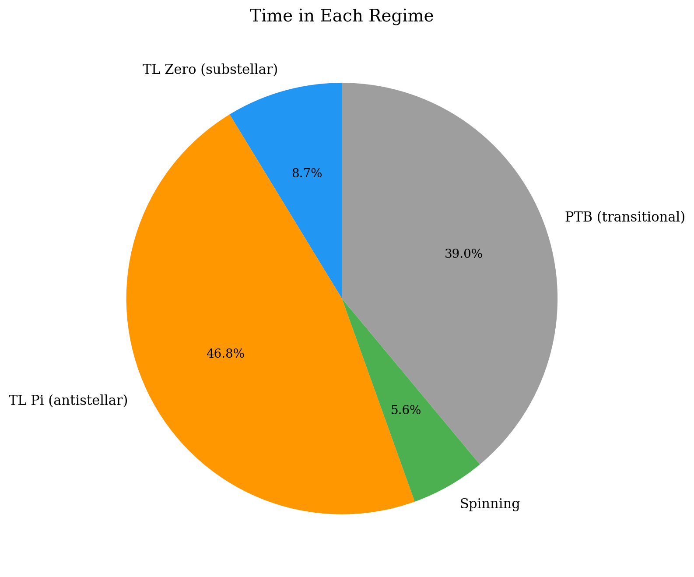
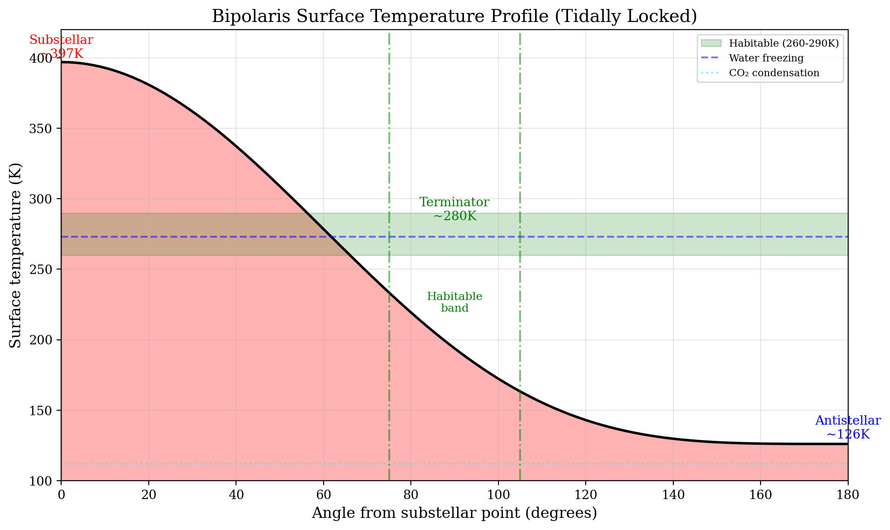
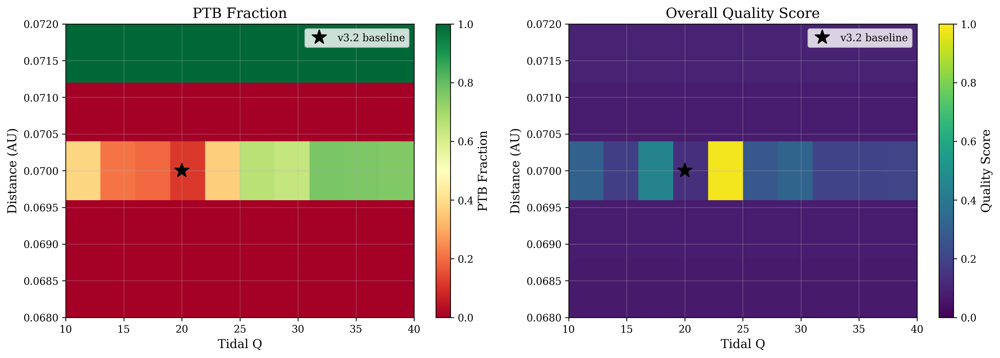

# stillspin

Spin dynamics simulations for tidally-locked exoplanets in broken resonance chains. A hobby project exploring what happens when a planetary system's resonant chain breaks and the resulting orbital perturbations desynchronize a tidally locked world.

## What's This About?

Most rocky planets in the habitable zones of M-dwarf stars are expected to be tidally locked — one face permanently toward the star. But what if the system's orbital architecture gets disrupted? The Shakespeare & Steffen (2023) "True Longitudinal Spin Resonance" (TLSR) model shows that secular perturbations from neighboring planets can cause a locked planet's substellar point to **flip between stable orientations** on decadal timescales.

This repo builds a specific test case — **Bipolaris**, an Earth-mass planet in a four-planet quasi-resonant chain around an M5.5V red dwarf — and explores the parameter space where this flip-flop behavior occurs.

## Example Output

The TLSR pipeline produces spin-orbit histories showing how the planet's orientation (γ) evolves over time, with distinct dynamical regimes color-coded:



The planet spends most of its time in one of two locked states (TL Zero = substellar lock, TL Pi = antistellar lock), with brief transitional periods between them:



The thermal sweep module computes surface temperature profiles for tidally locked configurations, showing the habitable terminator band:



The sensitivity analysis maps out where in parameter space (tidal Q vs orbital distance) flip-flop behavior emerges — it turns out to be a surprisingly narrow zone:



## The System

| Body | a (AU) | P (days) | Mass | Notes |
|------|--------|----------|------|-------|
| Star | — | — | 0.15 M☉ | M5.5V, 7.5 Gyr |
| b | 0.018 | 2.3 | 0.8 M⊕ | Hot |
| c | 0.032 | 5.4 | 1.4 M⊕ | Interior to HZ |
| **Bipolaris** | 0.0745 | 19.2 | 1.0 M⊕ | Middle HZ, flip-flop zone |
| d | 0.078 | 20.5 | 0.9 M⊕ | In HZ |
| Moon | 5 R⊕ | 18 hr | ~Ceres | Debris moon |
| Companion | 180 AU | — | 0.55 M☉ | K5V, incl 35° |

For 7+ Gyr, five planets orbited in a stable Laplace chain with Bipolaris tidally locked. ~500 Mya, Kozai-Lidov cycles from the distant companion ejected planet e, breaking the chain. The remaining planets now have elevated eccentricities that drive the flip-flop dynamics.

### Preliminary Observations

From the parameter sweeps so far:

- **Flip-flop behavior is real but narrow**: It only shows up in a ~500 μAU-wide band of orbital distance for a given tidal Q. Outside that band, the planet either stays permanently locked or spins freely.
- **Mean motion drives the transitions**: Perturbations to the orbital mean motion n(t) from neighboring planets matter more than eccentricity variations for triggering spin-state changes.
- **Tidal Q has sharp thresholds**: There's a bifurcation where a small change in Q flips the system from stable lock to chaotic flip-flopping.
- **The antistellar lock dominates**: TL_Pi (γ=π) captures ~47% of the time vs ~9% for TL_Zero (γ=0), with ~39% in transitional states.

These are based on limited integration times (~1000 yr) and haven't been validated against other codes. Take them with appropriate skepticism.

## Demos

| Demo | Library | Question |
|------|---------|----------|
| `tlsr-spin/` | REBOUND + custom | Does the architecture produce TLSR? What are the regime statistics? |
| `thermal-sweep/` | EBM | What surface temperatures result from different CO₂/albedo? |
| `rebound-stability/` | REBOUND | Is the system dynamically stable over Myr timescales? |
| `tidalpy-dissipation/` | TidalPy | How much tidal heating occurs? |
| `helios-atmosphere/` | HELIOS | What CO₂ level matches the temperature regime? |
| `chain-survey/` | REBOUND + tlsr_spin | How common are flip-flop worlds around M-dwarfs? Population synthesis. |

**Archived (deprecated physics):**
- `archive/obliquity-sweep/` — Colombo-Ward obliquity model (wrong for synchronous rotators)
- `archive/vplanet-obliquity/` — VPLanet obliquity evolution (same physics issue)

## Quick Start

```bash
# Install dependencies
uv sync --extra rebound

# Run TLSR quick smoke test (10k orbits, ~2 minutes)
uv run python tlsr-spin/sweep.py --quick

# Run full TLSR sweep (10M orbits × 30 configs, ~hours)
uv run python tlsr-spin/sweep.py

# Run stability check
uv run python rebound-stability/scenario.py --quick
```

## TLSR Pipeline

The `tlsr-spin/` module implements the Goldreich & Peale (1966) spin-orbit equation as used in Shakespeare & Steffen (2023):

Tidally locked planets with time-varying eccentricity experience a restoring torque toward synchronous rotation. When secular perturbations from other planets modulate e(t) faster than tidal damping can respond, the substellar point rotates, creating distinct dynamical regimes:

- **TL_ZERO** — Tidally locked at γ=0 (substellar point fixed)
- **TL_PI** — Tidally locked at γ=π (antistellar point to star)
- **SPINNING** — Continuous rotation (prograde or retrograde)
- **PTB** — Perturbed/transitional (<10 yr duration)

```
tlsr-spin/
├── physics.py              # Goldreich & Peale (1966) spin ODE
├── spin_integrator.py      # scipy solve_ivp driver
├── regime_classifier.py    # Regime identification
├── period_analysis.py      # Libration/spin period measurement
├── nbody.py               # REBOUND N-body → e(t), n(t)
├── plots.py               # Visualization
├── sweep.py               # Main CLI
└── validate.py            # Paper reproduction (needs SAfinal*.bin)
```

## Chain Survey

The `scripts/run_chain_survey.py` pipeline does population synthesis to ask: **How common are flip-flop worlds around M-dwarfs?**

Stages: generate formation-likely resonant chains → 500 Myr REBOUND evolution → perturbation probe → spin dynamics survey → population statistics.

```bash
# Full pipeline (quick mode)
uv run python scripts/run_chain_survey.py --all --quick --workers 4

# Individual stages
uv run python scripts/run_chain_survey.py --generate 5000 --seed 42
uv run python scripts/run_chain_survey.py --evolve --workers 24
uv run python scripts/run_chain_survey.py --calibrate --workers 24
uv run python scripts/run_chain_survey.py --learn-filter
uv run python scripts/run_chain_survey.py --probe --workers 24
uv run python scripts/run_chain_survey.py --spin-survey --workers 24
uv run python scripts/run_chain_survey.py --report
```

## Sensitivity Analysis

12-study parameter sweep quantifying how sensitive the flip-flop behavior is to system parameters:

```bash
uv run python scripts/sensitivity_analysis.py --all --workers 24
uv run python scripts/sensitivity_analysis.py --study 5 --workers 24
```

Studies cover Q-distance grids, Monte Carlo rarity estimation, resonance profiling, bifurcation mapping, and M-dwarf stellar mass sweeps.

## Testing

```bash
uv run pytest tests/ -v           # Infrastructure tests (~84 tests)
uv run pytest tlsr-spin/tests/ -v  # TLSR physics tests (~20 tests)
uv run pytest chain-survey/tests/ -v  # Chain survey tests (~80 tests)
```

## Structure

```
shared/              # System parameters, scenarios, analysis utilities
scripts/             # Sensitivity analysis, chain survey, plotting
tests/               # Infrastructure tests
tlsr-spin/           # TLSR spin dynamics (imports as tlsr_spin)
thermal-sweep/       # EBM thermal model (imports as thermal_sweep)
chain-survey/        # Resonant chain survey (imports as chain_survey)
rebound-stability/   # Orbital stability (REBOUND + MEGNO)
helios-atmosphere/   # Radiative transfer (HELIOS, CUDA)
tidalpy-dissipation/ # Tidal heating (TidalPy)
archive/             # Deprecated obliquity models
```

All system parameters live in `shared/constants.py` (single source of truth).

## License

GPL-3.0-or-later (required by REBOUND dependency). See [LICENSE](LICENSE).

| Scope | License | Packages |
|-------|---------|----------|
| Core | BSD-3-Clause | numpy, scipy, matplotlib |
| `rebound` extra | GPL-3.0 | rebound, reboundx |
| `tidalpy` extra | Apache-2.0 | TidalPy |
| `tidalpy` transitive | CC-BY-NC-SA-4.0 | cyrk |
| `vplanet` extra | MIT | vplanet |

## References

- Shakespeare & Steffen 2023, ApJ 959, 170 — TLSR model
- Goldreich & Peale 1966, AJ 71, 425 — Spin-orbit coupling
- MacDonald & Dawson 2018, AJ 156, 228 — TRAPPIST-1 migration
- Kopparapu et al. 2013, ApJ 765, 131 — HZ boundaries

## Notes

- The Colombo-Ward obliquity model (`archive/obliquity-sweep/`) is deprecated: J₂ ∝ ω² vanishes for synchronous rotation. TLSR is the correct physics.
- HELIOS requires CUDA — see `helios-atmosphere/README.md`
- TLSR validation requires Shakespeare & Steffen's SAfinal*.bin files (not included)
